# Auth — Sequence Diagrams (All Modes)

Mermaid diagrams for every auth flow in Doctor-System. Render in GitHub, VS Code (Mermaid preview), or [mermaid.live](https://mermaid.live).

**Related:** [AUTH_DEVELOPER.md](./AUTH_DEVELOPER.md) · [AUTH_ROLES_EXAMPLES.md](./AUTH_ROLES_EXAMPLES.md)

---

## Index

| # | Mode | Endpoint / path |
|---|------|-----------------|
| 1 | [Clinic onboard](#1-clinic-onboard-creates-owner--doctor) | `POST /clinics/onboard` |
| 2 | [Signup](#2-signup-public) | `POST /auth/signup` |
| 3 | [Login](#3-login-public) | `POST /auth/login` |
| 4 | [Refresh tokens](#4-refresh-token-rotation) | `POST /auth/refresh` |
| 5 | [Logout](#5-logout) | `POST /auth/logout` |
| 6 | [Current user](#6-get-me) | `GET /auth/me` |
| 7 | [Bearer token](#7-protected-route--bearer-header) | Any `jwtAuth` route |
| 8 | [Protected + RBAC](#8-protected-route--cookie--rbac--tenant) | e.g. billing, appointments |
| 9 | [Super admin](#9-super-admin-platform-routes) | `/admin/*`, subscription admin |
| 10 | [RBAC deny](#10-rbac-forbidden-wrong-role) | 403 path |
| 11 | [Signup blocked](#11-signup-blocked-super_admin) | `SUPER_ADMIN` on signup |
| 12 | [Overview](#12-all-modes-overview) | All modes on one diagram |

---

## 1. Clinic onboard (creates OWNER + DOCTOR)

Public. No JWT. Creates clinic and two users with hashed passwords.

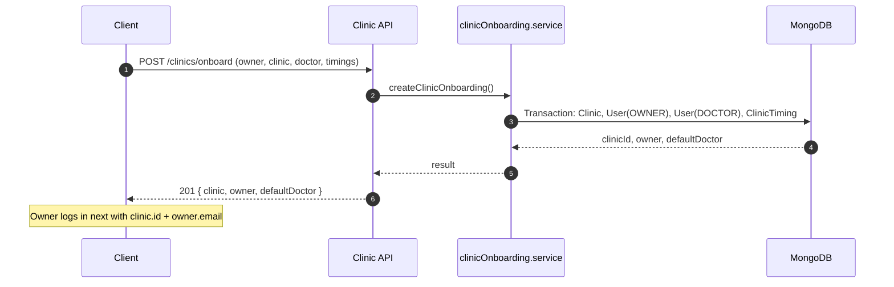

---

## 2. Signup (public)

Allowed roles: `CLINIC_OWNER`, `DOCTOR`, `STAFF`. `SUPER_ADMIN` → 403.

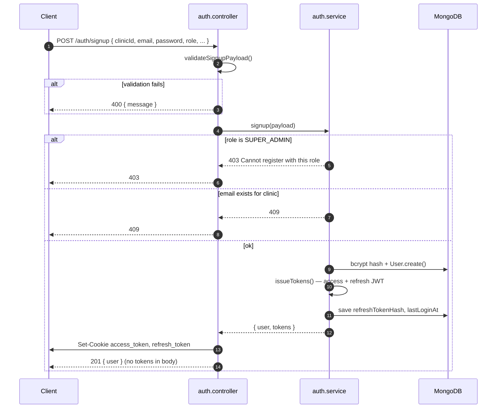

---

## 3. Login (public)

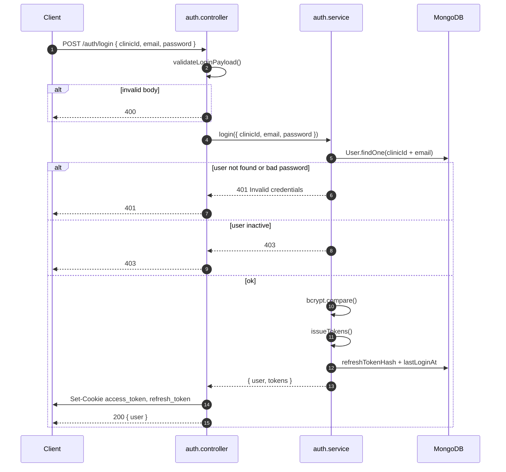

---

## 4. Refresh token (rotation)

Uses `refresh_token` cookie only. No access JWT required.

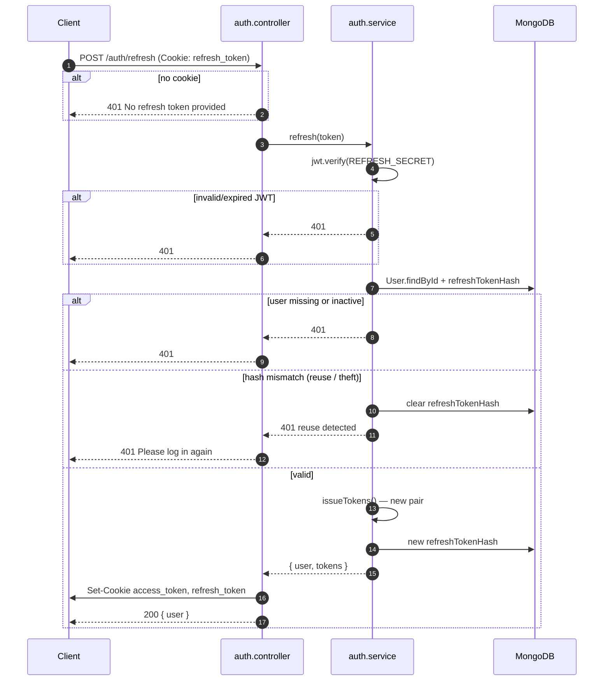

---

## 5. Logout

Requires valid access token (cookie or Bearer).

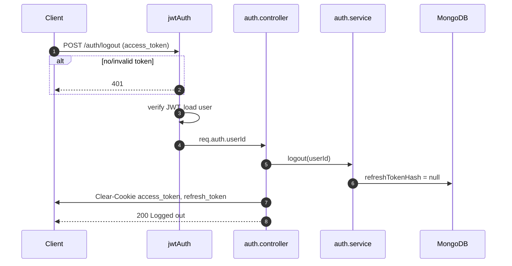

---

## 6. GET /me

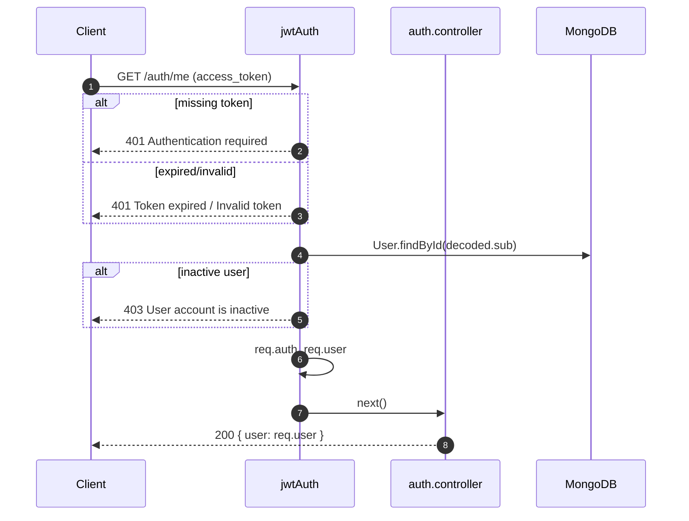

---

## 7. Protected route — Bearer header

Same as cookie path; token from `Authorization: Bearer`.

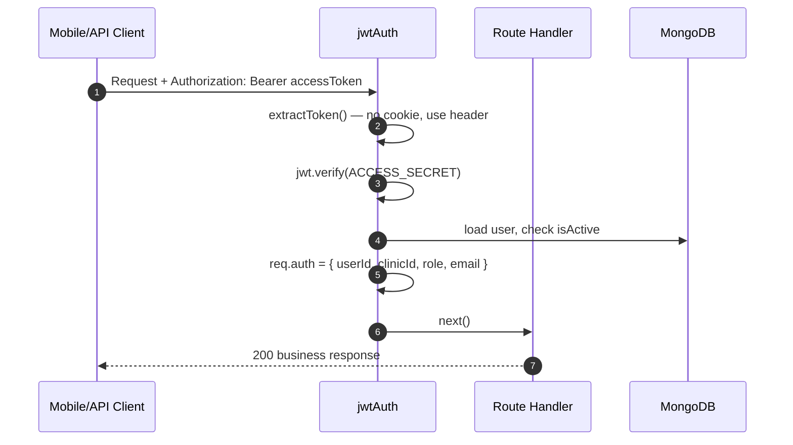

---

## 8. Protected route — cookie + RBAC + tenant

Typical pattern: `jwtAuth` → `injectClinicFromAuth` → `allowRoles` → controller.

Example: `POST /billing` for `CLINIC_OWNER` or `STAFF`.

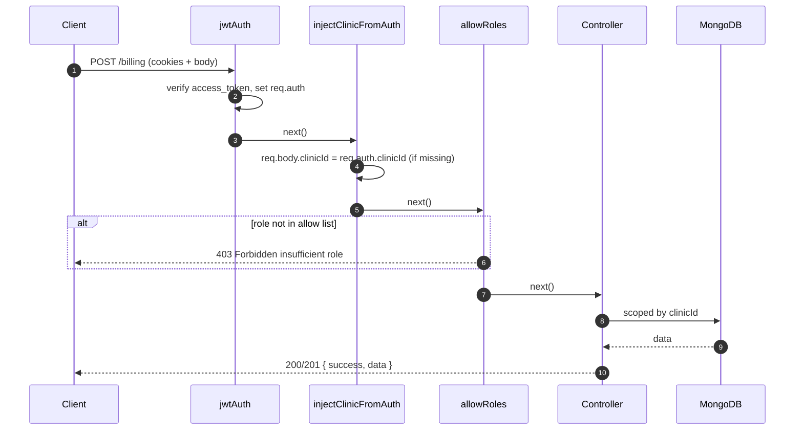

---

## 9. Super admin (platform routes)

`/admin/*` and `POST /subscriptions/admin/*` use `jwtAuth` + `requireSuperAdmin`.

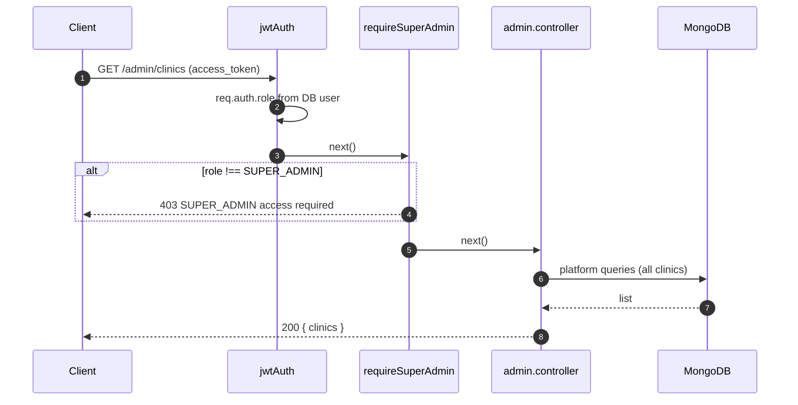

---

## 10. RBAC forbidden (wrong role)

Example: `STAFF` calls `GET /auth/admin-only` (only `SUPER_ADMIN`, `CLINIC_OWNER`).

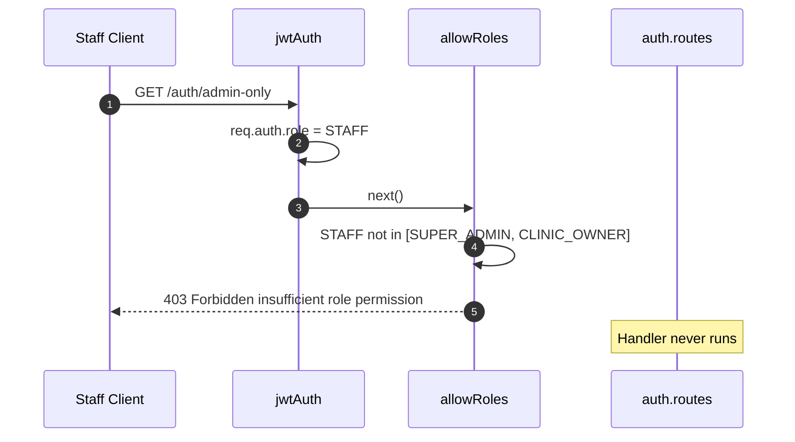

---

## 11. Signup blocked (SUPER_ADMIN)

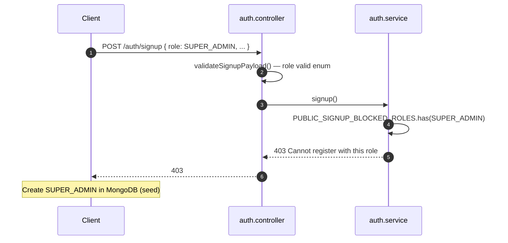

---

## 12. All modes overview

High-level map of how clients obtain and use credentials.

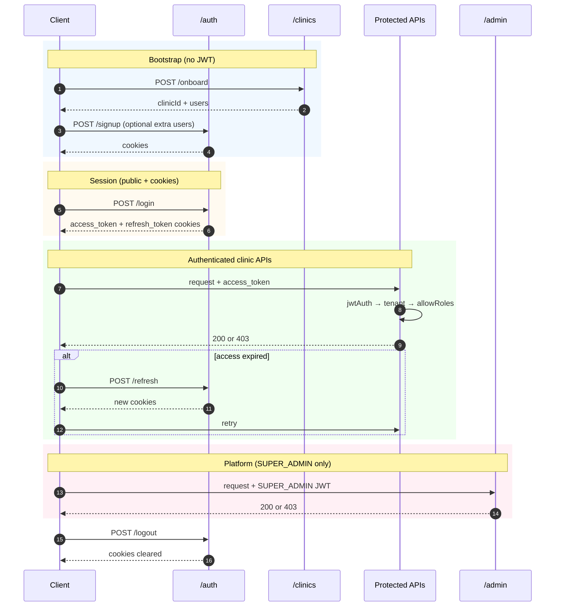

---

## Middleware order (reference)

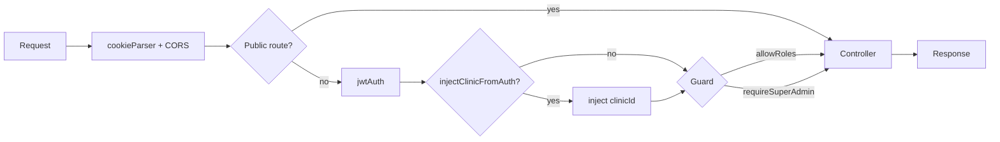

---

## Token lifecycle

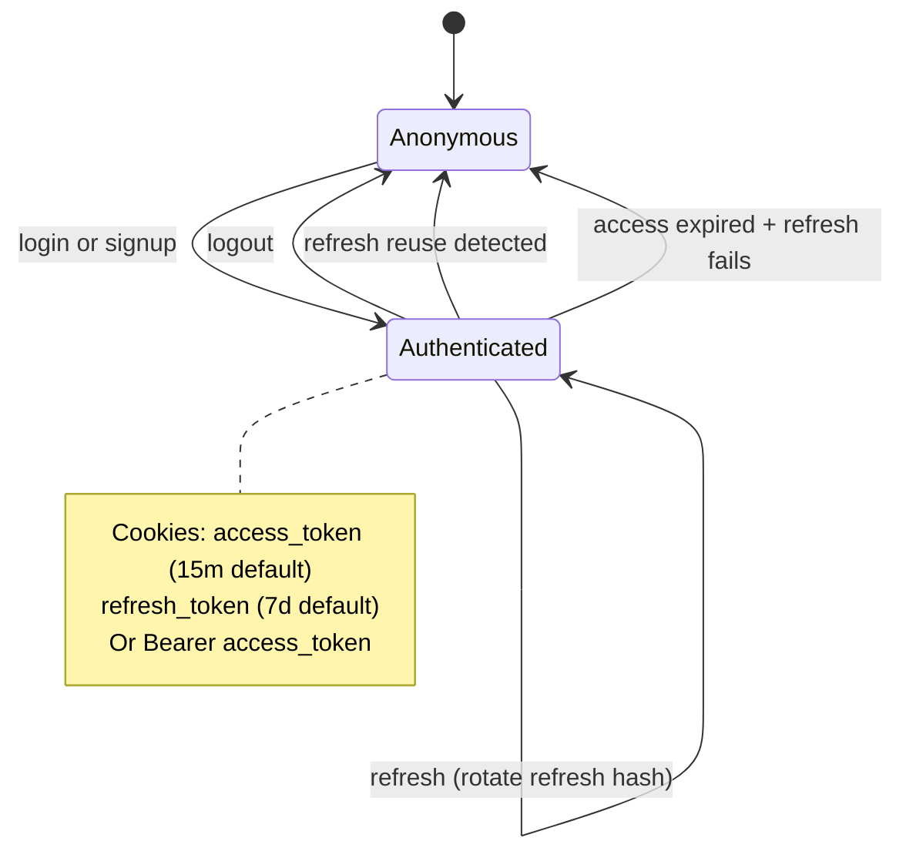
